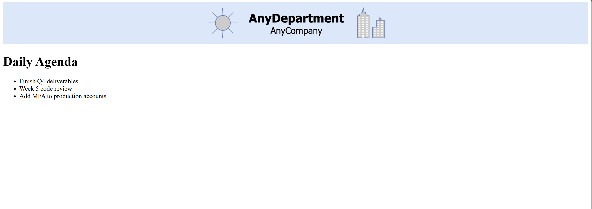

# ☁️ AWS CloudFormation Infrastructure Projects

[](https://aws.amazon.com/cloudformation/)
[](https://github.com/rman90/AWS-Projects)
[](LICENSE)

**Author:** Ross Nesbitt  
**GitHub:** [https://github.com/rman90](https://github.com/rman90)  
**Project Type:** Infrastructure as Code (IaC) Portfolio

---

## 📋 Overview

This repository demonstrates professional AWS infrastructure deployment using **AWS CloudFormation** templates. The project showcases both monolithic and modular (nested stack) approaches to Infrastructure as Code, deploying a fully functional web application called **Daily Agenda** on AWS.

The infrastructure includes VPC networking, EC2 compute resources, security groups, and automated instance bootstrapping—all defined as code and deployable with a single command.

### 🎯 Project Goals

- Demonstrate Infrastructure as Code best practices
- Showcase AWS CloudFormation expertise
- Illustrate the evolution from monolithic to modular infrastructure design
- Deploy a production-ready web application on AWS
- Highlight DevOps and Cloud Engineering skills

---

## 🏗️ Architecture

### High-Level Architecture Diagram

```
┌─────────────────────────────────────────────────────────────┐
│                         Internet                             │
└──────────────────────────┬──────────────────────────────────┘
                           │
                           │ HTTP (Port 80)
                           │
┌──────────────────────────▼──────────────────────────────────┐     
│                   Internet Gateway                           │
└──────────────────────────┬──────────────────────────────────┘
                           │
┌──────────────────────────▼──────────────────────────────────┐
│                    VPC (10.0.0.0/16)                         │
│  ┌────────────────────────────────────────────────────────┐ │
│  │         Public Subnet (10.0.0.0/24)                    │ │
│  │  ┌──────────────────────────────────────────────────┐ │ │
│  │  │         Security Group (HTTP: 0.0.0.0/0)         │ │ │
│  │  │  ┌────────────────────────────────────────────┐  │ │ │
│  │  │  │   EC2 Instance (t2.micro)                  │  │ │ │
│  │  │  │   - Amazon Linux 2                         │  │ │ │
│  │  │  │   - Apache Web Server                      │  │ │ │
│  │  │  │   - Daily Agenda Application               │  │ │ │
│  │  │  │   - SSM Parameter Store Integration        │  │ │ │
│  │  │  │   - EBS Volume (100GB)                     │  │ │ │
│  │  │  └────────────────────────────────────────────┘  │ │ │
│  │  └──────────────────────────────────────────────────┘ │ │
│  └────────────────────────────────────────────────────────┘ │
└─────────────────────────────────────────────────────────────┘
```

### 🔧 Infrastructure Components

| Component | Description | Purpose |
|-----------|-------------|---------|
| **VPC** | Virtual Private Cloud (10.0.0.0/16) | Isolated network environment |
| **Public Subnet** | 10.0.0.0/24 | Hosts publicly accessible resources |
| **Internet Gateway** | IGW attached to VPC | Enables internet connectivity |
| **Route Table** | Public route to 0.0.0.0/0 | Routes traffic to internet |
| **Security Group** | Ingress: HTTP (80), Egress: HTTP/HTTPS | Controls network access |
| **EC2 Instance** | t2.micro Amazon Linux 2 | Hosts web application |
| **EBS Volume** | 100GB additional storage | Persistent data storage |
| **SSM Parameter Store** | Stores daily agenda items | Configuration management |
| **IAM Instance Profile** | ec2ssm role | Grants SSM permissions |

---

## 📦 Project Structure

```
AWS-Projects/
│
├── README.md                          # Main documentation
│
├── diagrams/                          # Architecture diagrams
│   └── architecture-diagram.png
│
├── non-nested-template/               # Single template approach
│   └── daily-agenda-stack.yaml        # Complete infrastructure in one file
│
├── nested-stacks/                     # Modular nested stack approach
│   ├── parent-stack.yaml              # Root orchestration template
│   ├── network-stack.yaml             # VPC, subnets, IGW, routes
│   └── application-stack.yaml         # EC2, security groups, app config
│
└── docs/                              # Additional documentation
    ├── deployment-guide.md            # Step-by-step deployment instructions
    └── architecture-explanation.md    # Detailed architecture breakdown
```

---

## 🚀 Deployment Approaches

### Approach 1: Non-Nested CloudFormation Template

The **non-nested template** approach deploys all infrastructure components using a single CloudFormation template. This is ideal for:

- Simple, small-scale deployments
- Learning and experimentation
- Quick prototyping
- Single-team ownership

**Template:** [`non-nested-template/daily-agenda-stack.yaml`](non-nested-template/daily-agenda-stack.yaml)

**Resources Created:**
- VPC with DNS support
- Internet Gateway and VPC attachment
- Public route table and routes
- Public subnet
- EC2 instance with Apache web server
- Security group (HTTP access)
- EBS volume and attachment
- SSM Parameter Store parameter
- Automated bootstrap configuration

**Deployment Command:**
```bash
aws cloudformation create-stack \
  --stack-name daily-agenda-stack \
  --template-body file://non-nested-template/daily-agenda-stack.yaml \
  --parameters ParameterKey=DailyAgendaParameter,ParameterValue="Team standup,Code review,Deploy to production" \
               ParameterKey=LabUserRoleName,ParameterValue=LabRole \
  --capabilities CAPABILITY_IAM
```

---

### Approach 2: Nested Stack Architecture

The **nested stack** approach modularizes infrastructure into reusable, maintainable components. This is ideal for:

- Production environments
- Large-scale deployments
- Multi-team collaboration
- Infrastructure reusability
- Separation of concerns

**Templates:**
- **Parent Stack:** [`nested-stacks/parent-stack.yaml`](nested-stacks/parent-stack.yaml)
- **Network Stack:** [`nested-stacks/network-stack.yaml`](nested-stacks/network-stack.yaml)
- **Application Stack:** [`nested-stacks/application-stack.yaml`](nested-stacks/application-stack.yaml)

#### 🧩 Nested Stack Benefits

| Benefit | Description |
|---------|-------------|
| **Modularity** | Each stack focuses on a specific infrastructure layer |
| **Reusability** | Network stack can be reused across multiple applications |
| **Maintainability** | Changes to one component don't affect others |
| **Separation of Concerns** | Network team manages network stack, app team manages app stack |
| **Scalability** | Easy to add new nested stacks (e.g., database, monitoring) |
| **Version Control** | Track changes to individual components independently |

#### 📊 Stack Breakdown

**1. Parent Stack (Orchestration Layer)**
- Coordinates all nested stacks
- Passes outputs between stacks
- Manages stack dependencies
- Defines high-level parameters

**2. Network Stack (Infrastructure Layer)**
- VPC with DNS support enabled
- Public subnet configuration
- Internet Gateway
- Route tables and routes
- Network ACL associations
- **Outputs:** VPC ID, Subnet ID

**3. Application Stack (Compute Layer)**
- EC2 instance with Amazon Linux 2
- Security group configuration
- IAM instance profile
- EBS volume and attachment
- SSM Parameter Store integration
- Bootstrap scripts (UserData + cfn-init)
- Apache web server installation
- Daily Agenda application deployment
- **Outputs:** Public DNS URL

#### 🔄 Stack Dependencies

```
Parent Stack
    │
    ├─► Network Stack
    │       │
    │       └─► Outputs: VPC ID, Subnet ID
    │
    └─► Application Stack
            │
            └─► Inputs: VPC ID, Subnet ID (from Network Stack)
```

**Deployment Command:**
```bash
# Step 1: Upload nested templates to S3
aws s3 mb s3://templates-${AWS_ACCOUNT_ID}
aws s3 cp nested-stacks/network-stack.yaml s3://templates-${AWS_ACCOUNT_ID}/
aws s3 cp nested-stacks/application-stack.yaml s3://templates-${AWS_ACCOUNT_ID}/

# Step 2: Deploy parent stack
aws cloudformation create-stack \
  --stack-name daily-agenda-nested-stack \
  --template-body file://nested-stacks/parent-stack.yaml \
  --parameters ParameterKey=DailyAgendaParameterValue,ParameterValue="Finish Q4 deliverables,Week 5 code review,Add MFA to production accounts" \
  --capabilities CAPABILITY_IAM
```

---

## 🛠️ Quick Start Guide

### Prerequisites

- AWS Account with appropriate permissions
- AWS CLI installed and configured
- Basic understanding of CloudFormation
- SSH key pair (optional, for EC2 access)

### Deployment Steps

#### Option 1: Deploy Non-Nested Stack

```bash
# Clone the repository
git clone https://github.com/rman90/AWS-Projects.git
cd AWS-Projects

# Deploy the stack
aws cloudformation create-stack \
  --stack-name daily-agenda \
  --template-body file://non-nested-template/daily-agenda-stack.yaml \
  --parameters ParameterKey=DailyAgendaParameter,ParameterValue="Morning standup,Lunch meeting,Afternoon deployment" \
               ParameterKey=LabUserRoleName,ParameterValue=LabRole \
  --capabilities CAPABILITY_IAM

# Monitor stack creation
aws cloudformation describe-stacks --stack-name daily-agenda --query 'Stacks[0].StackStatus'

# Get the website URL
aws cloudformation describe-stacks \
  --stack-name daily-agenda \
  --query 'Stacks[0].Outputs[?OutputKey==`URL`].OutputValue' \
  --output text
```

#### Option 2: Deploy Nested Stacks

```bash
# Set your AWS account ID
export AWS_ACCOUNT_ID=$(aws sts get-caller-identity --query Account --output text)

# Create S3 bucket for templates
aws s3 mb s3://templates-${AWS_ACCOUNT_ID}

# Upload nested templates
aws s3 cp nested-stacks/network-stack.yaml s3://templates-${AWS_ACCOUNT_ID}/
aws s3 cp nested-stacks/application-stack.yaml s3://templates-${AWS_ACCOUNT_ID}/

# Deploy parent stack
aws cloudformation create-stack \
  --stack-name daily-agenda-nested \
  --template-body file://nested-stacks/parent-stack.yaml \
  --parameters ParameterKey=DailyAgendaParameterValue,ParameterValue="Team standup,Code review,Production deployment" \
  --capabilities CAPABILITY_IAM

# Monitor deployment
aws cloudformation wait stack-create-complete --stack-name daily-agenda-nested

# Get the website URL
aws cloudformation describe-stacks \
  --stack-name daily-agenda-nested \
  --query 'Stacks[0].Outputs[?OutputKey==`URL`].OutputValue' \
  --output text
```

### Accessing the Application

Once deployment completes:

1. Retrieve the output URL from CloudFormation
2. Open the URL in your web browser
3. You should see the **Daily Agenda** website with your configured agenda items

**Example Output:**
```
http://ec2-54-123-45-67.us-west-2.compute.amazonaws.com
```

---

## 📸 Screenshots

### Daily Agenda Website


---

## 🧪 Testing & Validation

### Verify Infrastructure

```bash
# Check VPC
aws ec2 describe-vpcs --filters "Name=tag:aws:cloudformation:stack-name,Values=daily-agenda"

# Check EC2 instance
aws ec2 describe-instances --filters "Name=tag:Name,Values=daily-agenda-service"

# Check Security Group
aws ec2 describe-security-groups --filters "Name=group-name,Values=*WebServerSecurityGroup*"

# Check SSM Parameter
aws ssm get-parameter --name /daily_agenda
```

### Test Application

```bash
# Get the public DNS
PUBLIC_DNS=$(aws cloudformation describe-stacks \
  --stack-name daily-agenda \
  --query 'Stacks[0].Outputs[?OutputKey==`URL`].OutputValue' \
  --output text)

# Test HTTP connectivity
curl -I $PUBLIC_DNS

# View the page
curl $PUBLIC_DNS
```

---

## 🔐 Security Considerations

### Implemented Security Features

- ✅ Security Group restricts ingress to HTTP (port 80) only
- ✅ Egress limited to HTTP/HTTPS for package updates
- ✅ IAM instance profile with least-privilege permissions
- ✅ SSM Parameter Store for configuration management
- ✅ No hardcoded credentials in templates
- ✅ VPC isolation with public/private subnet capability

### Production Recommendations

- 🔒 Add HTTPS/TLS with ACM certificates
- 🔒 Implement AWS WAF for web application firewall
- 🔒 Use private subnets with NAT Gateway for backend resources
- 🔒 Enable VPC Flow Logs for network monitoring
- 🔒 Implement CloudWatch alarms and monitoring
- 🔒 Use AWS Secrets Manager for sensitive data
- 🔒 Enable CloudTrail for audit logging
- 🔒 Implement backup strategies for EBS volumes

---

## 💡 Key Features

### Infrastructure as Code Benefits

- **Version Control:** All infrastructure changes tracked in Git
- **Reproducibility:** Deploy identical environments consistently
- **Documentation:** Code serves as living documentation
- **Automation:** Eliminate manual configuration errors
- **Disaster Recovery:** Rebuild infrastructure quickly from templates

### CloudFormation Features Demonstrated

- ✨ Intrinsic functions (`!Ref`, `!GetAtt`, `!Sub`, `!Select`, `!GetAZs`)
- ✨ Nested stack orchestration
- ✨ Cross-stack references and outputs
- ✨ Parameters and parameter types
- ✨ Resource dependencies (`DependsOn`)
- ✨ CloudFormation Init (cfn-init) for bootstrapping
- ✨ UserData scripts for instance configuration
- ✨ Creation policies and wait conditions
- ✨ Resource metadata

---

## 📚 Documentation

- **[Deployment Guide](docs/deployment-guide.md)** - Detailed step-by-step deployment instructions
- **[Architecture Explanation](docs/architecture-explanation.md)** - In-depth architecture breakdown
- **[AWS CloudFormation Documentation](https://docs.aws.amazon.com/cloudformation/)** - Official AWS docs

---

## 🎓 Skills Demonstrated

This project showcases the following technical competencies:

### Cloud Engineering
- AWS VPC networking and subnet design
- EC2 instance provisioning and configuration
- Security group and network ACL management
- Internet Gateway and routing configuration
- IAM roles and instance profiles

### Infrastructure as Code
- CloudFormation template development
- Nested stack architecture design
- Template parameterization and reusability
- Resource dependency management
- Stack outputs and cross-stack references

### DevOps Practices
- Infrastructure automation
- Configuration management with SSM Parameter Store
- Bootstrap automation (UserData + cfn-init)
- Version control for infrastructure
- Modular, maintainable code structure

### AWS Services
- Amazon EC2
- Amazon VPC
- AWS CloudFormation
- AWS Systems Manager Parameter Store
- Amazon EBS
- AWS IAM
- Amazon S3 (for nested templates)

---

## 🔄 Cleanup

To avoid ongoing AWS charges, delete the stacks when finished:

### Delete Non-Nested Stack
```bash
aws cloudformation delete-stack --stack-name daily-agenda
aws cloudformation wait stack-delete-complete --stack-name daily-agenda
```

### Delete Nested Stack
```bash
# Delete parent stack (automatically deletes nested stacks)
aws cloudformation delete-stack --stack-name daily-agenda-nested
aws cloudformation wait stack-delete-complete --stack-name daily-agenda-nested

# Clean up S3 bucket
aws s3 rm s3://templates-${AWS_ACCOUNT_ID}/ --recursive
aws s3 rb s3://templates-${AWS_ACCOUNT_ID}
```

---

## 🚧 Future Improvements

- [ ] Add Application Load Balancer for high availability
- [ ] Implement Auto Scaling Group for scalability
- [ ] Add RDS database for persistent data storage
- [ ] Implement multi-AZ deployment for fault tolerance
- [ ] Add CloudWatch dashboards and alarms
- [ ] Implement CI/CD pipeline with AWS CodePipeline
- [ ] Add HTTPS with ACM certificates
- [ ] Implement AWS WAF for security
- [ ] Add CloudFront CDN for global distribution
- [ ] Create additional nested stacks (database, monitoring, logging)

---

## 📝 Lessons Learned

### Nested Stacks vs. Monolithic Templates

**When to use Nested Stacks:**
- Large, complex infrastructure
- Multi-team environments
- Reusable components across projects
- Clear separation of concerns needed

**When to use Monolithic Templates:**
- Simple, small deployments
- Single-team ownership
- Rapid prototyping
- Learning and experimentation

### Best Practices Applied

1. **Parameterization:** Use parameters for environment-specific values
2. **Outputs:** Export values for cross-stack references
3. **Naming Conventions:** Use consistent, descriptive resource names
4. **Comments:** Document complex logic and resource purposes
5. **DependsOn:** Explicitly define resource dependencies when needed
6. **Deletion Policies:** Protect critical resources from accidental deletion

---

## 🤝 Contributing

Contributions, issues, and feature requests are welcome! Feel free to check the [issues page](https://github.com/rman90/AWS-Projects/issues).

---

## 📄 License

This project is licensed under the MIT License - see the [LICENSE](LICENSE) file for details.

---

## 👤 Author

**Ross Nesbitt**

- GitHub: [@rman90](https://github.com/rman90)
- LinkedIn: [Connect with me](https://www.linkedin.com/in/ross-nesbitt-395647138)
- Portfolio: [View my projects](https://github.com/rman90)

---

## ⭐ Show Your Support

If you found this project helpful, please give it a ⭐️!

---

## 📞 Contact

For questions or collaboration opportunities, feel free to reach out through GitHub or LinkedIn.

---

**Built with ☁️ by Ross Nesbitt | AWS Cloud Engineer & DevOps Enthusiast**
